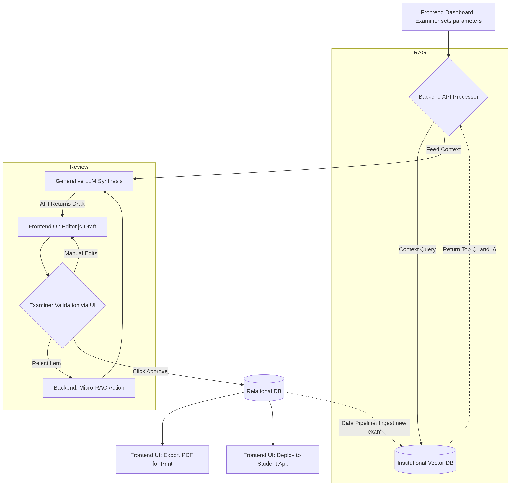
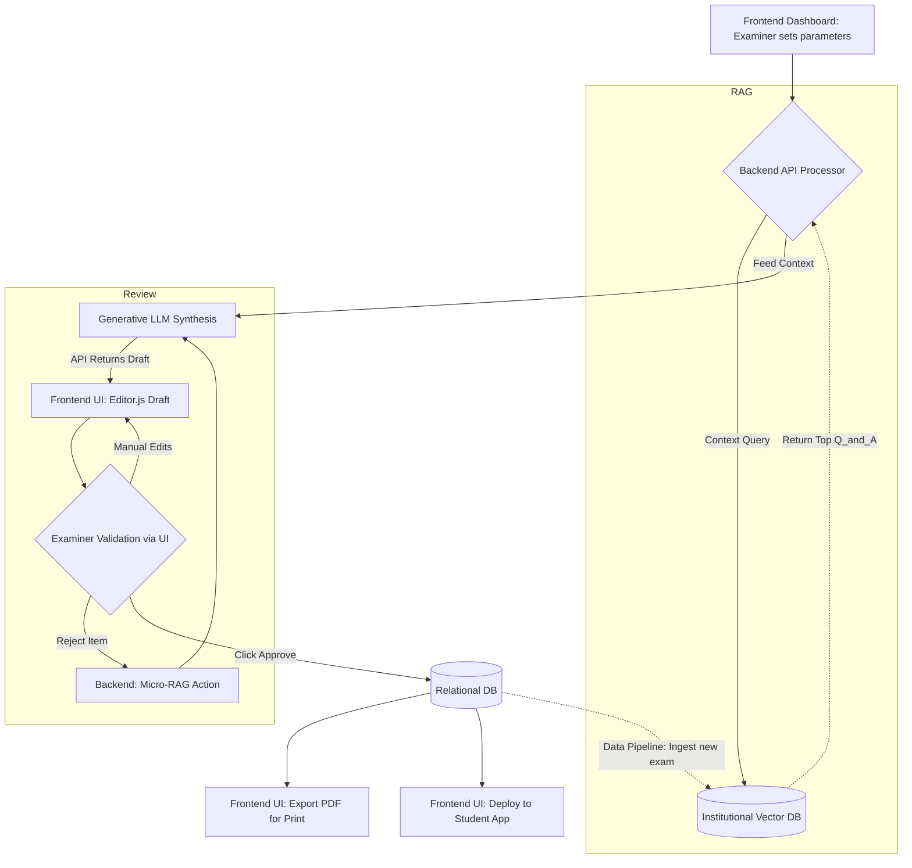

# Examify Enterprise: AI Generation Technical Workflow
**Human-in-the-Loop RAG Architecture for Automated Exam Creation**

To ensure maximum quality, academic alignment, and prevent AI hallucinations, Examify Enterprise utilizes a sophisticated **Retrieval-Augmented Generation (RAG)** pipeline. Here is the step-by-step technical and user workflow detailing how an examiner generates a new exam from historical institutional data.

## Architecture Diagram

## Phase 1: Parameter Selection (Frontend UI)
The process begins when an examiner logs into the Enterprise dashboard. Instead of relying on a generic, open-ended text prompt (which yields inconsistent results), the UI provides precise, programmatic controls to define the structural blueprint of the assessment.

**Inputs Captured:**
* **Course/Module ID:** Links the query to specific institutional silos in the database.
* **Exam Constraints:** Duration (e.g., 2 hours), Total Marks (e.g., 100).
* **Topic Weighting Matrix:** Examiners define exactly what percentages of the exam should cover specific curriculum topics (e.g., 40% Kinetics, 60% Thermodynamics).
* **Difficulty Curve Distribution:** Algorithmic balance of cognitive load (e.g., 20% Easy, 50% Medium, 30% Hard).
* **Question Formats:** Ratios of Multiple Choice, Essay, Short Answer, or Coding questions.

## Phase 2: Intelligent Vector Retrieval (Backend RAG)
Dumping decades of past papers directly into a generative LLM is slow, prohibitively expensive, and prone to context-window degradation. Instead, our backend employs a highly optimized Semantic Vector Search.

**The Process:**
1. **Query Construction:** The backend translates the frontend parameters into a series of semantic queries.
2. **Vector DB Search:** The system scans the institution's secure vector database (containing only their officially approved past papers and marking schemes).
3. **Filtering & Ranking:** It retrieves a curated subset of historical questions that computationally match the requested topics, formats, and difficulty weights.
4. **Context Assembly:** This high-quality, dense subset of data is assembled into the final prompt context, ensuring the generative AI is fully grounded in the institution's proprietary data.

## Phase 3: AI Synthesis & Generation (LLM Processing)
With the hyper-relevant context gathered, the backend interfaces with the generative LLM. 

**The Execution:**
* **Prompt Engineering:** The AI is instructed via system prompts to act as an expert academic author.
* **Synthesis:** It uses the retrieved historical context (past questions, formats, and answers) to synthesize *brand new* questions. 
* **Plagiarism Prevention:** The AI tests the exact same concepts and difficulty levels but actively rewrites the scenarios and data to avoid repeating the literal text of past papers. This effectively neutralizes cheating via rote memorization of past exams.
* **Answer Generation:** Alongside the question, it simultaneously generates the automated step-by-step marking scheme.

## Phase 4: Human-in-the-Loop Review (Editor.js)
Because educators need ultimate authority, the AI's output is treated as a "draft" rather than a final product. The generated exam blueprint is instantly returned via API and rendered in Examify's rich **Editor.js** interface.

**Examiner Controls:**
* **Inline Regeneration:** If the examiner dislikes a specific question (e.g., Question 4), they can click "Regenerate." The backend runs a targeted micro-RAG query to swap it for a different variant instantly.
* **Granular Editing:** The examiner can manually tweak the text, adjust allocated marks, or rewrite specific instructions directly in the block editor.
* **Source Validation (Lineage):** The UI explicitly tags each new question with its lineage, showing the examiner exactly which historical exams and topics inspired the AI's generation.

## Phase 5: Publish, Distribute, & Ingest (System Loop)
Once the examiner is fully satisfied with the exam, they finalize the process.

**The Outputs:**
1. **Database Commit:** The finalized exam (and marking scheme) is securely saved back to the relational database.
2. **Multi-Format Export:** The exam can be exported as a neatly formatted, print-ready PDF for traditional physical administration.
3. **Digital Deployment:** It is pushed directly to the Exampapel B2C digital portal for immediate student access or scheduled for a live digital assessment.
4. **Data Flywheel:** Crucially, this *new* exam is embedded and ingested back into the institution's vector database, making the RAG pool even smarter for the next semester.
