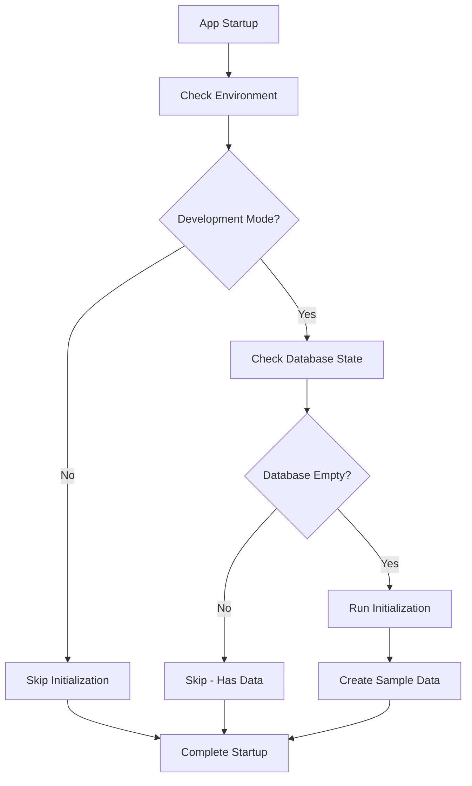

# Smart Startup System Documentation

## Overview

The Smart Startup System is an intelligent database initialization system that prevents duplicate data creation and only runs initialization when appropriate. It's designed to handle different environments (development, production, testing) and database states intelligently.

## 🎯 Key Features

### 1. **Environment-Aware Initialization**
- **Development Mode**: Automatically initializes empty databases
- **Production Mode**: Never auto-initializes (safety first)
- **Testing Mode**: Configurable behavior

### 2. **Database State Detection**
- Checks multiple key tables for existing data
- Prevents duplicate initialization
- Provides detailed status reporting

### 3. **Smart Decision Making**
- Only initializes when database is completely empty
- Respects environment settings
- Provides clear logging and feedback

### 4. **Comprehensive Status Reporting**
- Health check endpoints with database status
- Detailed table-by-table analysis
- Record counts and connection status

## 🔧 How It Works

### Startup Flow



### Database State Check

The system checks these key tables:
- `users` - User accounts
- `roles` - User roles
- `institutions` - Educational institutions
- `questions` - Exam questions
- `question_sets` - Question collections

**Initialization only runs if ALL tables are empty.**

## 📁 File Structure

```
app/core/startup.py          # Main startup logic
app/api/v1/endpoints/health.py  # Health check endpoints
app/db/init_db.py           # Database initialization logic
app/core/config.py          # Environment configuration
```

## 🚀 Usage

### Automatic Startup (Recommended)

The system runs automatically when the FastAPI application starts:

```python
# In main.py lifespan function
await startup_tasks()
```

### Manual Control

```python
from app.core.startup import should_initialize_database, initialize_database

# Check if initialization should run
should_init = await should_initialize_database()

# Force initialization (use with caution)
await initialize_database()
```

### Health Checks

```bash
# Basic health check
curl http://localhost:8000/health

# Detailed health with database status
curl http://localhost:8000/health/detailed

# Comprehensive database status
curl http://localhost:8000/health/database
```

## 🔍 Environment Configuration

### Development Mode (Default)
```bash
ENVIRONMENT=development
```
**Behavior:**
- ✅ Auto-initializes empty databases
- ✅ Provides detailed logging
- ✅ Continues on initialization errors
- ✅ Shows comprehensive status

### Production Mode
```bash
ENVIRONMENT=production
```
**Behavior:**
- ❌ Never auto-initializes
- ⚠️  Fails startup on initialization errors
- 📊 Provides status information
- 🔒 Safety-first approach

### Testing Mode
```bash
ENVIRONMENT=testing
```
**Behavior:**
- 🧪 Configurable initialization
- 🔄 Suitable for test environments
- 📝 Detailed logging for debugging

## 📊 Status Information

### Health Check Response Example

```json
{
  "status": "healthy",
  "connection_status": "connected",
  "environment": "development",
  "tables_with_data": {
    "users": true,
    "roles": true,
    "institutions": true,
    "questions": true,
    "question_sets": true
  },
  "record_counts": {
    "users": 3,
    "roles": 3,
    "institutions": 1247,
    "questions": 16,
    "question_sets": 10
  },
  "total_tables_checked": 5,
  "tables_with_data_count": 5,
  "initialization_complete": true
}
```

## 🔄 Common Scenarios

### Scenario 1: Fresh Development Setup
```
Environment: development
Database: empty
Result: ✅ Auto-initialization runs
```

### Scenario 2: Development with Existing Data
```
Environment: development
Database: has data
Result: ⏭️ Initialization skipped
```

### Scenario 3: Production Deployment
```
Environment: production
Database: any state
Result: ❌ No auto-initialization
```

### Scenario 4: Hot Reload in Development
```
Environment: development
Database: has data (from previous run)
Result: ⏭️ Initialization skipped (prevents duplicates)
```

## 🛠️ Troubleshooting

### Issue: Database Not Initializing

**Check:**
1. Environment mode: `echo $ENVIRONMENT`
2. Database connection: `curl http://localhost:8000/health/database`
3. Table status: Check health endpoint response

**Solutions:**
```bash
# Force development mode
export ENVIRONMENT=development

# Clear database (if needed)
make clear-dummy-db

# Restart application
make run-dev
```

### Issue: Duplicate Data

**Cause:** Manual initialization while data exists

**Prevention:** The smart startup system prevents this automatically

**Fix:**
```bash
# Clear existing data
make clear-dummy-db

# Restart to reinitialize
make run-dev
```

### Issue: Production Auto-Initialization

**Cause:** Environment not set to production

**Fix:**
```bash
# Set production mode
export ENVIRONMENT=production

# Restart application
```

## 📝 Logging

The system provides comprehensive logging:

```
🚀 Starting FastAPI application startup tasks...
🔧 Environment: development
✅ Database connection successful
🆕 Database is empty - initialization will proceed
🔧 Proceeding with database initialization...
✅ Database initialization completed successfully!
📊 Final state: 5/5 tables now have data
🎉 All startup tasks completed successfully!
```

### Log Levels

- **INFO**: Normal operation status
- **DEBUG**: Detailed table checking
- **WARNING**: Non-critical issues
- **ERROR**: Initialization failures

## 🔐 Security Considerations

### Production Safety
- Never auto-initializes in production
- Requires explicit manual initialization
- Fails fast on configuration errors

### Development Convenience
- Auto-initializes empty databases
- Prevents duplicate data
- Provides detailed feedback

### Data Protection
- Checks existing data before initialization
- Prevents accidental overwrites
- Maintains data integrity

## 🧪 Testing

### Unit Tests
```python
# Test database state checking
async def test_check_database_has_data():
    # Test implementation

# Test initialization decision logic
async def test_should_initialize_database():
    # Test implementation
```

### Integration Tests
```bash
# Test with empty database
make test-empty-db

# Test with existing data
make test-existing-data

# Test environment modes
make test-environments
```

## 🚀 Best Practices

### Development
1. **Use development mode** for auto-initialization
2. **Check health endpoints** for status
3. **Clear database** when needed for fresh start
4. **Monitor logs** for initialization status

### Production
1. **Set production mode** explicitly
2. **Initialize manually** if needed
3. **Monitor health endpoints** for status
4. **Have backup/restore procedures**

### CI/CD
1. **Use testing mode** in pipelines
2. **Clear database** between test runs
3. **Verify initialization** in deployment scripts
4. **Check health endpoints** after deployment

## 📈 Benefits

### For Developers
- ✅ No more duplicate data issues
- ✅ Automatic setup for new environments
- ✅ Clear status information
- ✅ Hot reload friendly

### For Operations
- ✅ Environment-aware behavior
- ✅ Production safety
- ✅ Comprehensive health checks
- ✅ Detailed logging

### For Testing
- ✅ Predictable initialization
- ✅ Clean test environments
- ✅ Status verification
- ✅ Configurable behavior

## 🔮 Future Enhancements

### Planned Features
- [ ] Database migration integration
- [ ] Custom initialization profiles
- [ ] Rollback capabilities
- [ ] Performance metrics
- [ ] Advanced health checks

### Configuration Options
- [ ] Table-specific initialization
- [ ] Conditional data loading
- [ ] External data sources
- [ ] Initialization scheduling

## 📞 Support

### Health Check Endpoints
- `GET /health` - Basic status
- `GET /health/detailed` - Detailed status
- `GET /health/database` - Database-specific status
- `GET /ready` - Readiness probe
- `GET /live` - Liveness probe

### Debugging
1. Check environment variables
2. Verify database connection
3. Review application logs
4. Use health endpoints
5. Check table status

### Common Commands
```bash
# Check current status
curl http://localhost:8000/health/database

# View logs
docker-compose logs fastapi_server

# Restart with fresh database
make clear-dummy-db && make run-dev

# Force production mode
ENVIRONMENT=production make run-dev
```

This smart startup system ensures reliable, environment-appropriate database initialization while preventing common issues like duplicate data and unnecessary reinitialization during development.
